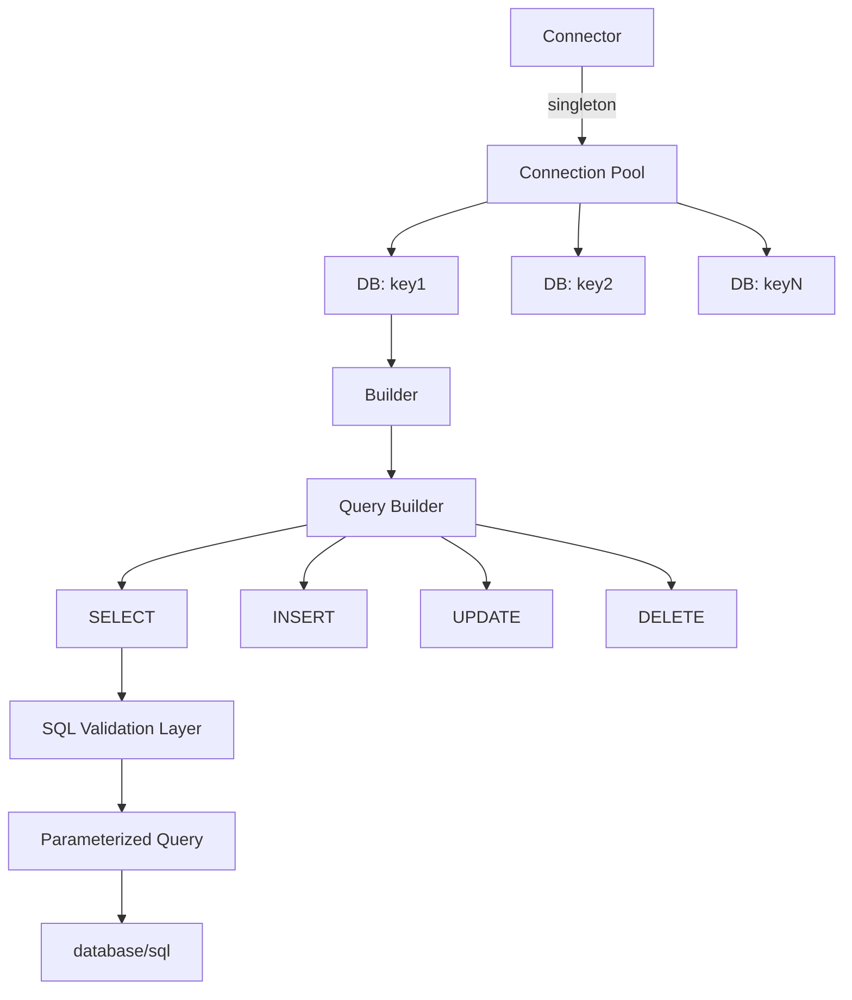

> [!NOTE]
> This README was generated by [Claude Code](https://github.com/pardnchiu/skill-readme-generate), get the ZH version from [here](./README.zh.md).


# go-sqlite

[](https://pkg.go.dev/github.com/pardnchiu/go-sqlite)
[](https://goreportcard.com/report/github.com/pardnchiu/go-sqlite)
[](LICENSE)

> Lightweight SQLite Query Builder built on `database/sql` and `mattn/go-sqlite3`, providing chainable API, connection pool management, and Context support.

## Table of Contents

- [Features](#features)
- [Architecture](#architecture)
- [Installation](#installation)
- [Quick Start](#quick-start)
- [Usage](#usage)
  - [Initialize Connection](#initialize-connection)
  - [Create Table](#create-table)
  - [Insert Data](#insert-data)
  - [Query Data](#query-data)
  - [Update Data](#update-data)
  - [Delete Data](#delete-data)
  - [Advanced Queries](#advanced-queries)
  - [Context Support](#context-support)
- [API Reference](#api-reference)
  - [Connector](#connector)
  - [Builder](#builder)
  - [Query Methods](#query-methods)
  - [Mutation Methods](#mutation-methods)
  - [Advanced Operations](#advanced-operations)
- [License](#license)
- [Author](#author)
- [Stars](#stars)

## Features

- **Chainable API Design**: Fluent method chaining for improved code readability
- **Connection Pool Management**: Singleton pattern with `sync.Once`, supports multiple database instances
- **WAL Mode**: Automatically enables Write-Ahead Logging for better concurrency
- **SQL Injection Protection**: Built-in column name validation and SQL reserved keyword checking
- **Native Context Support**: Full integration with `context.Context` for timeouts and cancellations
- **Conflict Resolution Strategies**: Supports `IGNORE`, `REPLACE`, `ABORT`, `FAIL`, `ROLLBACK`
- **Type Safety**: Explicit error wrapping and parameterized queries
- **Zero-Dependency Core**: Relies only on standard library and `mattn/go-sqlite3`

## Architecture



**Design Decisions:**
- **Singleton Connector**: Prevents duplicate connection overhead, uses `sync.Mutex` for concurrency safety
- **Builder Pattern**: Creates new Builder instance per query to avoid state pollution
- **Validation Layer**: Validates column names and reserved keywords before SQL construction

## Installation

```bash
go get github.com/pardnchiu/go-sqlite
```

**Requirements:**
- Go ≥ 1.20
- CGO enabled (required by `mattn/go-sqlite3`)

## Quick Start

```go
package main

import (
    "log"
    goSqlite "github.com/pardnchiu/go-sqlite"
)

func main() {
    // Initialize connection
    conn, err := goSqlite.New(goSqlite.Config{
        Key:      "myapp",
        Path:     "./data.db",
        Lifetime: 3600,
    })
    if err != nil {
        log.Fatal(err)
    }
    defer conn.Close()

    // Get Builder
    db, err := conn.DB("myapp")
    if err != nil {
        log.Fatal(err)
    }

    // Create table
    err = db.Table("users").Create(
        goSqlite.Column{Name: "id", Type: "INTEGER", IsPrimary: true, AutoIncrease: true},
        goSqlite.Column{Name: "name", Type: "TEXT", IsNullable: false},
        goSqlite.Column{Name: "email", Type: "TEXT", IsUnique: true},
    )
    if err != nil {
        log.Fatal(err)
    }

    // Insert data
    lastID, err := db.Table("users").Insert(map[string]any{
        "name":  "Alice",
        "email": "alice@example.com",
    })
    if err != nil {
        log.Fatal(err)
    }
    log.Printf("Inserted ID: %d", lastID)

    // Query data
    rows, err := db.Table("users").Select("id", "name").Where("id = ?", lastID).Get()
    if err != nil {
        log.Fatal(err)
    }
    defer rows.Close()

    for rows.Next() {
        var id int
        var name string
        rows.Scan(&id, &name)
        log.Printf("User: %d - %s", id, name)
    }
}
```

## Usage

### Initialize Connection

```go
// Basic configuration
conn, err := goSqlite.New(goSqlite.Config{
    Key:      "mydb",           // Connection identifier
    Path:     "./database.db",  // SQLite file path
    Lifetime: 3600,             // Connection lifetime in seconds
})

// Auto-generate Key from filename when omitted
conn, err := goSqlite.New(goSqlite.Config{
    Path: "./users.db", // Key automatically set to "users"
})
```

**Connection Pool Settings:**
- `MaxOpenConns`: 8 (default)
- `MaxIdleConns`: 2 (default)
- `journal_mode`: WAL (automatically enabled)

### Create Table

```go
db, _ := conn.DB("mydb")

err := db.Table("products").Create(
    goSqlite.Column{
        Name:         "id",
        Type:         "INTEGER",
        IsPrimary:    true,
        AutoIncrease: true,
    },
    goSqlite.Column{
        Name:       "sku",
        Type:       "TEXT",
        IsUnique:   true,
        IsNullable: false,
    },
    goSqlite.Column{
        Name:    "price",
        Type:    "REAL",
        Default: 0.0,
    },
    goSqlite.Column{
        Name: "category_id",
        Type: "INTEGER",
        ForeignKey: &goSqlite.Foreign{
            Table:  "categories",
            Column: "id",
        },
    },
)
```

### Insert Data

```go
// Basic insert
lastID, err := db.Table("users").Insert(map[string]any{
    "name":  "Bob",
    "email": "bob@example.com",
})

// Ignore on conflict
lastID, err := db.Table("users").
    Conflict(goSqlite.Ignore).
    Insert(map[string]any{
        "email": "bob@example.com",
        "name":  "Bob",
    })

// Upsert (update on conflict)
lastID, err := db.Table("users").Insert(
    map[string]any{"email": "bob@example.com", "name": "Bob"},
    map[string]any{"name": "Bob Updated"}, // Update name on conflict
)
```

**Conflict Strategies:**
- `goSqlite.Ignore`: Skip on conflict
- `goSqlite.Replace`: Replace entire row on conflict
- `goSqlite.Abort`: Abort transaction on conflict
- `goSqlite.Fail`: Fail without rollback on conflict
- `goSqlite.Rollback`: Rollback transaction on conflict

### Query Data

```go
// Query all columns
rows, err := db.Table("users").Get()

// Query specific columns
rows, err := db.Table("users").Select("id", "name").Get()

// WHERE conditions
rows, err := db.Table("users").
    Where("age > ?", 18).
    Where("status = ?", "active").
    Get()

// OR conditions
rows, err := db.Table("users").
    Where("role = ?", "admin").
    OrWhere("role = ?", "moderator").
    Get()

// LIMIT and OFFSET
rows, err := db.Table("users").
    Limit(10).
    Offset(20).
    Get()

// Ordering
rows, err := db.Table("users").
    OrderBy("created_at", goSqlite.Desc).
    OrderBy("name", goSqlite.Asc).
    Get()
```

### Update Data

```go
// Basic update
affected, err := db.Table("users").
    Where("id = ?", 1).
    Update(map[string]any{
        "name":  "Alice Updated",
        "email": "alice.new@example.com",
    })

// Increment numeric value
affected, err := db.Table("products").
    Where("id = ?", 100).
    Increase("stock", 10). // stock = stock + 10
    Update()

// Decrement numeric value
affected, err := db.Table("users").
    Where("id = ?", 1).
    Decrease("credits", 5). // credits = credits - 5
    Update()

// Toggle boolean value
affected, err := db.Table("settings").
    Where("key = ?", "notifications").
    Toggle("enabled"). // enabled = NOT enabled
    Update()
```

### Delete Data

```go
// Conditional delete
affected, err := db.Table("users").
    Where("status = ?", "inactive").
    Delete()

// Force delete all records (requires explicit force flag)
affected, err := db.Table("logs").Delete(true)

// Delete first 10 records
affected, err := db.Table("temp_data").
    OrderBy("created_at", goSqlite.Asc).
    Limit(10).
    Delete()
```

**Safety Restrictions:**
- Requires `Delete(true)` when no WHERE conditions specified
- SQLite does not support JOIN in DELETE operations

### Advanced Queries

```go
// JOIN operations
rows, err := db.Table("orders").
    Select("orders.id", "users.name", "products.title").
    Join("users", "orders.user_id = users.id").
    LeftJoin("products", "orders.product_id = products.id").
    Where("orders.status = ?", "completed").
    Get()

// Pagination with total count
rows, err := db.Table("posts").
    Select("id", "title").
    Where("published = ?", 1).
    OrderBy("created_at", goSqlite.Desc).
    Limit(20).
    Offset(40).
    Total(). // Calculate total count
    Get()

// Read total count
for rows.Next() {
    var id int
    var title string
    var total int // Total() adds total column to each row
    rows.Scan(&total, &id, &title)
}
```

### Context Support

```go
ctx, cancel := context.WithTimeout(context.Background(), 5*time.Second)
defer cancel()

// Use Context in queries
rows, err := db.Table("users").
    Context(ctx).
    Where("status = ?", "active").
    Get()

// Use Context in inserts
lastID, err := db.Table("logs").
    Context(ctx).
    Insert(map[string]any{
        "level":   "info",
        "message": "operation completed",
    })

// Use Context in updates
affected, err := db.Table("sessions").
    Context(ctx).
    Where("expired_at < ?", time.Now().Unix()).
    Delete()
```

## API Reference

### Connector

**`New(config Config) (*Connector, error)`**

Create or retrieve Connector singleton.

| Parameter | Type | Description |
|-----------|------|-------------|
| `config.Key` | `string` | Connection identifier (optional, defaults to filename) |
| `config.Path` | `string` | SQLite file path |
| `config.Lifetime` | `int` | Connection lifetime in seconds (optional) |

**`DB(key string) (*Builder, error)`**

Retrieve Builder instance for specified key.

**`Query(key, query string, args ...any) (*sql.Rows, error)`**

Execute SELECT query directly.

**`Exec(key, query string, args ...any) (sql.Result, error)`**

Execute INSERT/UPDATE/DELETE query directly.

**`Close()`**

Close all database connections.

### Builder

**`Table(name string) *Builder`**

Set target table name for operations.

**`Raw() *sql.DB`**

Retrieve underlying `*sql.DB` instance for advanced operations.

**`Create(columns ...Column) error`**

Create table if not exists.

### Query Methods

**`Select(columns ...string) *Builder`**

Specify query columns (defaults to `*`).

**`Where(condition string, args ...any) *Builder`**

Add AND WHERE condition.

**`OrWhere(condition string, args ...any) *Builder`**

Add OR WHERE condition.

**`Join(table, on string) *Builder`**

Add INNER JOIN.

**`LeftJoin(table, on string) *Builder`**

Add LEFT JOIN.

**`OrderBy(column string, direction ...direction) *Builder`**

Add ordering (`goSqlite.Asc` or `goSqlite.Desc`).

**`Limit(num ...int) *Builder`**

Set LIMIT (one parameter) or OFFSET + LIMIT (two parameters).

**`Offset(num int) *Builder`**

Set OFFSET.

**`Total() *Builder`**

Include total count in results (uses `COUNT(*) OVER()`).

**`Get() (*sql.Rows, error)`**

Execute query and return result set.

### Mutation Methods

**`Insert(data ...map[string]any) (int64, error)`**

Insert data and return `LastInsertId`. Second map (optional) for ON CONFLICT UPDATE.

**`Update(data ...map[string]any) (int64, error)`**

Update data and return affected rows count.

**`Delete(force ...bool) (int64, error)`**

Delete data and return affected rows count. Requires `force=true` without WHERE.

### Advanced Operations

**`Conflict(strategy conflict) *Builder`**

Set INSERT conflict strategy.

**`Increase(column string, num ...int) *Builder`**

Increment column value (defaults to +1).

**`Decrease(column string, num ...int) *Builder`**

Decrement column value (defaults to -1).

**`Toggle(column string) *Builder`**

Toggle boolean column value.

**`Context(ctx context.Context) *Builder`**

Set query Context (for timeout/cancellation).

## License

MIT License

## Author


<h4 style="padding-top: 0">邱敬幃 Pardn Chiu</h4>

<a href="mailto:dev@pardn.io" target="_blank">

</a> <a href="https://linkedin.com/in/pardnchiu" target="_blank">

</a>

## Stars

[](https://www.star-history.com/#pardnchiu/go-sqlite&Date)

***

©️ 2026 [邱敬幃 Pardn Chiu](https://linkedin.com/in/pardnchiu)
