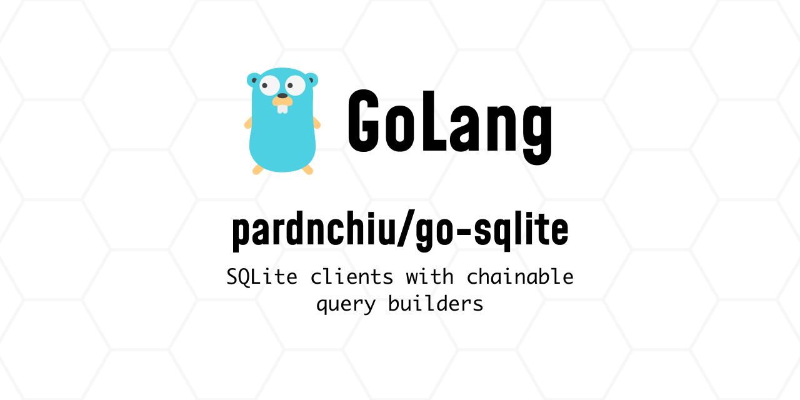

> [!NOTE]
> This README was generated by [Claude Code](https://github.com/anthropics/claude-code), get the ZH version from [here](./README.zh.md).

# go-sqlite

[](https://pkg.go.dev/github.com/pardnchiu/go-sqlite)
[](LICENSE)

> Lightweight SQLite ORM built on [sqlite3 driver](https://github.com/mattn/go-sqlite3) and `database/sql`, featuring a consistent API with [go-mysql](https://github.com/pardnchiu/go-mysql).

## Table of Contents

- [Features](#features)
- [Installation](#installation)
- [Usage](#usage)
- [API Reference](#api-reference)
- [License](#license)
- [Author](#author)
- [Stars](#stars)

## Features

- **Connection Pool Management**: Support multiple database connection pools, managed by key
- **Builder Pattern**: Chainable SQL query construction with Select/Where/Join/OrderBy/Limit/Offset
- **Complete CRUD Operations**:
  - `Insert` series: Support conflict handling strategies (Ignore/Replace/Abort/Fail/Rollback)
  - `Update` series: Support Increase/Decrease/Toggle atomic operations
  - `Select` series: Support First/Count/Total extended queries
- **Where Conditions**: Eq/NotEq/Gt/Lt/Ge/Le/In/NotIn/Null/NotNull/Between methods
- **Context Support**: All major operations provide Context versions for timeout and cancellation
- **Auto State Clearing**: Builder state automatically resets after each query execution
- **SQL Injection Protection**: Built-in column name validation and parameterized queries

## Installation

```bash
go get github.com/pardnchiu/go-sqlite
```

## Usage

### Initialize Connection

```go
package main

import (
    goSqlite "github.com/pardnchiu/go-sqlite"
)

func main() {
    // Create database connection
    db, conn, err := goSqlite.New(goSqlite.Config{
        Key:      "main",           // Connection pool key (optional, defaults to filename)
        Path:     "./data.db",      // Database path
        Lifetime: 3600,             // Connection lifetime in seconds
    })
    if err != nil {
        panic(err)
    }
    defer db.Close()
}
```

### Create Table

```go
builder, _ := db.DB("main")

err := builder.Table("users").Create(
    goSqlite.Column{Name: "id", Type: "INTEGER", IsPrimary: true, AutoIncrease: true},
    goSqlite.Column{Name: "name", Type: "TEXT", IsNullable: false},
    goSqlite.Column{Name: "email", Type: "TEXT", IsUnique: true},
    goSqlite.Column{Name: "age", Type: "INTEGER", Default: 0},
    goSqlite.Column{Name: "is_active", Type: "INTEGER", Default: 1},
)
```

### Insert Data

```go
// Basic insert
err := builder.Table("users").Insert(map[string]any{
    "name":  "John",
    "email": "john@example.com",
    "age":   25,
})

// Insert and get ID
id, err := builder.Table("users").InsertReturningID(map[string]any{
    "name":  "Jane",
    "email": "jane@example.com",
})

// Conflict handling
err = builder.Table("users").InsertConflict(goSqlite.Ignore, map[string]any{
    "name":  "John",
    "email": "john@example.com",
})
```

### Query Data

```go
// Query multiple rows
rows, err := builder.Table("users").
    Select("id", "name", "email").
    WhereGt("age", 18).
    OrderBy("name", "ASC").
    Limit(10).
    Get()

// Query single row
row, err := builder.Table("users").
    WhereEq("id", 1).
    First()

// Count rows
count, err := builder.Table("users").
    WhereEq("is_active", 1).
    Count()

// Paginated query with total count (using Window Function)
rows, err := builder.Table("users").
    Total().
    Limit(10).
    Offset(20).
    Get()
```

### Update Data

```go
// Basic update
result, err := builder.Table("users").
    WhereEq("id", 1).
    Update(map[string]any{"name": "John Doe"})

// Increment field
result, err = builder.Table("users").
    WhereEq("id", 1).
    Increase("login_count", 1).
    Update()

// Toggle boolean
result, err = builder.Table("users").
    WhereEq("id", 1).
    Toggle("is_active").
    Update()
```

### JOIN Queries

```go
rows, err := builder.Table("orders").
    Select("orders.id", "users.name", "orders.total").
    Join("users", "users.id = orders.user_id").
    WhereGt("orders.total", 100).
    Get()

// LEFT JOIN
rows, err = builder.Table("users").
    LeftJoin("orders", "orders.user_id = users.id").
    Get()
```

### Context Support

```go
ctx, cancel := context.WithTimeout(context.Background(), 5*time.Second)
defer cancel()

// Query
rows, err := builder.Table("users").GetContext(ctx)

// Insert
err = builder.Table("users").InsertContext(ctx, data)

// Update
result, err := builder.Table("users").
    WhereEq("id", 1).
    UpdateContext(ctx, data)
```

## API Reference

### Config

| Field | Type | Description |
|-------|------|-------------|
| `Key` | `string` | Connection pool identifier, defaults to filename |
| `Path` | `string` | SQLite database file path |
| `Lifetime` | `int` | Maximum connection lifetime in seconds |

### Column

| Field | Type | Description |
|-------|------|-------------|
| `Name` | `string` | Column name |
| `Type` | `string` | SQLite data type |
| `IsPrimary` | `bool` | Primary key flag |
| `IsNullable` | `bool` | Allow NULL values |
| `AutoIncrease` | `bool` | Auto increment |
| `IsUnique` | `bool` | Unique constraint |
| `Default` | `any` | Default value |
| `ForeignKey` | `*Foreign` | Foreign key configuration |

### Conflict Strategies

| Constant | Description |
|----------|-------------|
| `Ignore` | Skip insert on conflict |
| `Replace` | Replace existing data |
| `Abort` | Abort transaction (default) |
| `Fail` | Fail but keep prior changes |
| `Rollback` | Rollback entire transaction |

### Builder Methods

| Method | Description |
|--------|-------------|
| `Table(name)` | Set target table |
| `Create(columns...)` | Create table |
| `Select(columns...)` | Set query columns |
| `Where(condition, args...)` | Add WHERE condition (AND) |
| `OrWhere(condition, args...)` | Add WHERE condition (OR) |
| `WhereEq/WhereNotEq/WhereGt/WhereLt/WhereGe/WhereLe` | Comparison conditions |
| `WhereIn/WhereNotIn` | IN conditions |
| `WhereNull/WhereNotNull` | NULL checks |
| `WhereBetween` | BETWEEN range |
| `Join(table, on)` | INNER JOIN |
| `LeftJoin(table, on)` | LEFT JOIN |
| `OrderBy(column, direction)` | Sorting |
| `Limit(num)` / `Offset(num)` | Pagination |
| `Total()` | Enable Window Function for total count |
| `Get()` / `GetContext(ctx)` | Execute query, return multiple rows |
| `First()` / `FirstContext(ctx)` | Execute query, return single row |
| `Count()` / `CountContext(ctx)` | Count rows |
| `Insert(data)` / `InsertContext(ctx, data)` | Insert data |
| `InsertReturningID(data)` | Insert and return ID |
| `InsertConflict(conflict, data)` | Insert with conflict handling |
| `Update(data)` / `UpdateContext(ctx, data)` | Update data |
| `Increase(column, num)` | Increment field value |
| `Decrease(column, num)` | Decrement field value |
| `Toggle(column)` | Toggle boolean value |

## License

MIT License

## Author


<h4 style="padding-top: 0">邱敬幃 Pardn Chiu</h4>

<a href="mailto:dev@pardn.io" target="_blank">

</a> <a href="https://linkedin.com/in/pardnchiu" target="_blank">

</a>

## Stars

[](https://www.star-history.com/#pardnchiu/go-sqlite&Date)

***

©️ 2026 [邱敬幃 Pardn Chiu](https://linkedin.com/in/pardnchiu)
