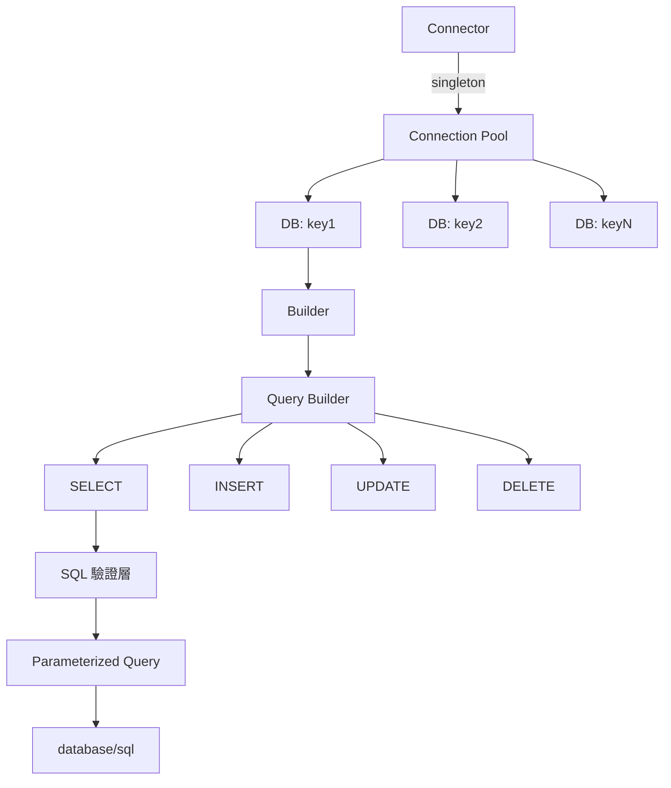

> [!NOTE]
> 此 README 由 [Claude Code](https://github.com/pardnchiu/skill-readme-generate) 生成，英文版請參閱 [這裡](./README.md)。


# go-sqlite

[](https://pkg.go.dev/github.com/pardnchiu/go-sqlite)
[](https://goreportcard.com/report/github.com/pardnchiu/go-sqlite)
[](LICENSE)

> 基於 `database/sql` 與 `mattn/go-sqlite3` 的輕量型 SQLite Query Builder，提供鏈式 API、Connection Pool 管理與 Context 支援。

## 目錄

- [功能特點](#功能特點)
- [架構設計](#架構設計)
- [安裝](#安裝)
- [快速開始](#快速開始)
- [使用方法](#使用方法)
  - [初始化連線](#初始化連線)
  - [建立資料表](#建立資料表)
  - [插入資料](#插入資料)
  - [查詢資料](#查詢資料)
  - [更新資料](#更新資料)
  - [刪除資料](#刪除資料)
  - [進階查詢](#進階查詢)
  - [Context 支援](#context-支援)
- [API 參考](#api-參考)
  - [Connector](#connector)
  - [Builder](#builder)
  - [Query 方法](#query-方法)
  - [Mutation 方法](#mutation-方法)
  - [進階操作](#進階操作)
- [授權](#授權)
- [Author](#author)
- [Stars](#stars)

## 功能特點

- **鏈式 API 設計**：流暢的方法串接，提升程式碼可讀性
- **Connection Pool 管理**：使用 `sync.Once` 確保單例模式，支援多 DB 管理
- **WAL 模式**：自動啟用 Write-Ahead Logging 提升並發效能
- **SQL Injection 防護**：內建 Column 名稱驗證與 SQL 保留字檢查
- **Context 原生支援**：完整整合 `context.Context` 用於 Timeout/Cancellation
- **衝突處理策略**：支援 `IGNORE`、`REPLACE`、`ABORT`、`FAIL`、`ROLLBACK`
- **型別安全**：明確的 Error Wrapping 與參數化查詢
- **零依賴核心**：僅依賴標準函式庫與 `mattn/go-sqlite3`

## 架構設計



**設計決策：**
- **Singleton Connector**：避免重複連線開銷，使用 `sync.Mutex` 保證並發安全
- **Builder Pattern**：每次查詢建立新 Builder 實例，避免狀態污染
- **Validation Layer**：在 SQL 構建前進行 Column 名稱與保留字檢查

## 安裝

```bash
go get github.com/pardnchiu/go-sqlite
```

**需求：**
- Go ≥ 1.20
- CGO enabled（`mattn/go-sqlite3` 需要）

## 快速開始

```go
package main

import (
    "log"
    goSqlite "github.com/pardnchiu/go-sqlite"
)

func main() {
    // 初始化連線
    conn, err := goSqlite.New(goSqlite.Config{
        Key:      "myapp",
        Path:     "./data.db",
        Lifetime: 3600,
    })
    if err != nil {
        log.Fatal(err)
    }
    defer conn.Close()

    // 取得 Builder
    db, err := conn.DB("myapp")
    if err != nil {
        log.Fatal(err)
    }

    // 建立資料表
    err = db.Table("users").Create(
        goSqlite.Column{Name: "id", Type: "INTEGER", IsPrimary: true, AutoIncrease: true},
        goSqlite.Column{Name: "name", Type: "TEXT", IsNullable: false},
        goSqlite.Column{Name: "email", Type: "TEXT", IsUnique: true},
    )
    if err != nil {
        log.Fatal(err)
    }

    // 插入資料
    lastID, err := db.Table("users").Insert(map[string]any{
        "name":  "Alice",
        "email": "alice@example.com",
    })
    if err != nil {
        log.Fatal(err)
    }
    log.Printf("Inserted ID: %d", lastID)

    // 查詢資料
    rows, err := db.Table("users").Select("id", "name").Where("id = ?", lastID).Get()
    if err != nil {
        log.Fatal(err)
    }
    defer rows.Close()

    for rows.Next() {
        var id int
        var name string
        rows.Scan(&id, &name)
        log.Printf("User: %d - %s", id, name)
    }
}
```

## 使用方法

### 初始化連線

```go
// 基本配置
conn, err := goSqlite.New(goSqlite.Config{
    Key:      "mydb",           // 連線識別名稱
    Path:     "./database.db",  // SQLite 檔案路徑
    Lifetime: 3600,             // 連線生命週期（秒）
})

// 省略 Key 時自動使用檔名
conn, err := goSqlite.New(goSqlite.Config{
    Path: "./users.db", // Key 自動設為 "users"
})
```

**Connection Pool 設定：**
- `MaxOpenConns`: 8（預設）
- `MaxIdleConns`: 2（預設）
- `journal_mode`: WAL（自動啟用）

### 建立資料表

```go
db, _ := conn.DB("mydb")

err := db.Table("products").Create(
    goSqlite.Column{
        Name:         "id",
        Type:         "INTEGER",
        IsPrimary:    true,
        AutoIncrease: true,
    },
    goSqlite.Column{
        Name:       "sku",
        Type:       "TEXT",
        IsUnique:   true,
        IsNullable: false,
    },
    goSqlite.Column{
        Name:    "price",
        Type:    "REAL",
        Default: 0.0,
    },
    goSqlite.Column{
        Name: "category_id",
        Type: "INTEGER",
        ForeignKey: &goSqlite.Foreign{
            Table:  "categories",
            Column: "id",
        },
    },
)
```

### 插入資料

```go
// 基本插入
lastID, err := db.Table("users").Insert(map[string]any{
    "name":  "Bob",
    "email": "bob@example.com",
})

// 衝突時忽略
lastID, err := db.Table("users").
    Conflict(goSqlite.Ignore).
    Insert(map[string]any{
        "email": "bob@example.com",
        "name":  "Bob",
    })

// Upsert（衝突時更新）
lastID, err := db.Table("users").Insert(
    map[string]any{"email": "bob@example.com", "name": "Bob"},
    map[string]any{"name": "Bob Updated"}, // 衝突時更新 name
)
```

**衝突策略：**
- `goSqlite.Ignore`：衝突時跳過
- `goSqlite.Replace`：衝突時替換整列
- `goSqlite.Abort`：衝突時中止 Transaction
- `goSqlite.Fail`：衝突時失敗但不回滾
- `goSqlite.Rollback`：衝突時回滾 Transaction

### 查詢資料

```go
// 查詢所有欄位
rows, err := db.Table("users").Get()

// 查詢指定欄位
rows, err := db.Table("users").Select("id", "name").Get()

// WHERE 條件
rows, err := db.Table("users").
    Where("age > ?", 18).
    Where("status = ?", "active").
    Get()

// OR 條件
rows, err := db.Table("users").
    Where("role = ?", "admin").
    OrWhere("role = ?", "moderator").
    Get()

// LIMIT 與 OFFSET
rows, err := db.Table("users").
    Limit(10).
    Offset(20).
    Get()

// 排序
rows, err := db.Table("users").
    OrderBy("created_at", goSqlite.Desc).
    OrderBy("name", goSqlite.Asc).
    Get()
```

### 更新資料

```go
// 基本更新
affected, err := db.Table("users").
    Where("id = ?", 1).
    Update(map[string]any{
        "name":  "Alice Updated",
        "email": "alice.new@example.com",
    })

// 遞增數值
affected, err := db.Table("products").
    Where("id = ?", 100).
    Increase("stock", 10). // stock = stock + 10
    Update()

// 遞減數值
affected, err := db.Table("users").
    Where("id = ?", 1).
    Decrease("credits", 5). // credits = credits - 5
    Update()

// 切換布林值
affected, err := db.Table("settings").
    Where("key = ?", "notifications").
    Toggle("enabled"). // enabled = NOT enabled
    Update()
```

### 刪除資料

```go
// 條件刪除
affected, err := db.Table("users").
    Where("status = ?", "inactive").
    Delete()

// 強制刪除所有記錄（需明確指定 force）
affected, err := db.Table("logs").Delete(true)

// 刪除前 10 筆
affected, err := db.Table("temp_data").
    OrderBy("created_at", goSqlite.Asc).
    Limit(10).
    Delete()
```

**安全限制：**
- 無 WHERE 條件時必須使用 `Delete(true)` 強制執行
- SQLite 不支援 DELETE 的 JOIN 操作

### 進階查詢

```go
// JOIN 操作
rows, err := db.Table("orders").
    Select("orders.id", "users.name", "products.title").
    Join("users", "orders.user_id = users.id").
    LeftJoin("products", "orders.product_id = products.id").
    Where("orders.status = ?", "completed").
    Get()

// 分頁查詢（帶總數）
rows, err := db.Table("posts").
    Select("id", "title").
    Where("published = ?", 1).
    OrderBy("created_at", goSqlite.Desc).
    Limit(20).
    Offset(40).
    Total(). // 額外計算總筆數
    Get()

// 讀取總數
for rows.Next() {
    var id int
    var title string
    var total int // Total() 會在每列加入 total 欄位
    rows.Scan(&total, &id, &title)
}
```

### Context 支援

```go
ctx, cancel := context.WithTimeout(context.Background(), 5*time.Second)
defer cancel()

// 查詢時使用 Context
rows, err := db.Table("users").
    Context(ctx).
    Where("status = ?", "active").
    Get()

// 插入時使用 Context
lastID, err := db.Table("logs").
    Context(ctx).
    Insert(map[string]any{
        "level":   "info",
        "message": "operation completed",
    })

// 更新時使用 Context
affected, err := db.Table("sessions").
    Context(ctx).
    Where("expired_at < ?", time.Now().Unix()).
    Delete()
```

## API 參考

### Connector

**`New(config Config) (*Connector, error)`**

建立或取得 Connector 單例。

| 參數 | 類型 | 說明 |
|------|------|------|
| `config.Key` | `string` | 連線識別名稱（可選，預設為檔名） |
| `config.Path` | `string` | SQLite 檔案路徑 |
| `config.Lifetime` | `int` | 連線生命週期（秒，可選） |

**`DB(key string) (*Builder, error)`**

取得指定 Key 的 Builder 實例。

**`Query(key, query string, args ...any) (*sql.Rows, error)`**

直接執行 SELECT 查詢。

**`Exec(key, query string, args ...any) (sql.Result, error)`**

直接執行 INSERT/UPDATE/DELETE 查詢。

**`Close()`**

關閉所有資料庫連線。

### Builder

**`Table(name string) *Builder`**

設定操作的資料表名稱。

**`Raw() *sql.DB`**

取得底層 `*sql.DB` 實例用於進階操作。

**`Create(columns ...Column) error`**

建立資料表（若不存在）。

### Query 方法

**`Select(columns ...string) *Builder`**

指定查詢欄位（預設為 `*`）。

**`Where(condition string, args ...any) *Builder`**

新增 AND WHERE 條件。

**`OrWhere(condition string, args ...any) *Builder`**

新增 OR WHERE 條件。

**`Join(table, on string) *Builder`**

新增 INNER JOIN。

**`LeftJoin(table, on string) *Builder`**

新增 LEFT JOIN。

**`OrderBy(column string, direction ...direction) *Builder`**

新增排序（`goSqlite.Asc` 或 `goSqlite.Desc`）。

**`Limit(num ...int) *Builder`**

設定 LIMIT（一個參數）或 OFFSET + LIMIT（兩個參數）。

**`Offset(num int) *Builder`**

設定 OFFSET。

**`Total() *Builder`**

在結果中包含總筆數（使用 `COUNT(*) OVER()`）。

**`Get() (*sql.Rows, error)`**

執行查詢並返回結果集。

### Mutation 方法

**`Insert(data ...map[string]any) (int64, error)`**

插入資料並返回 `LastInsertId`。第二個 map（可選）用於 ON CONFLICT UPDATE。

**`Update(data ...map[string]any) (int64, error)`**

更新資料並返回受影響列數。

**`Delete(force ...bool) (int64, error)`**

刪除資料並返回受影響列數。無 WHERE 時需 `force=true`。

### 進階操作

**`Conflict(strategy conflict) *Builder`**

設定 INSERT 衝突策略。

**`Increase(column string, num ...int) *Builder`**

遞增欄位值（預設 +1）。

**`Decrease(column string, num ...int) *Builder`**

遞減欄位值（預設 -1）。

**`Toggle(column string) *Builder`**

切換布林值欄位。

**`Context(ctx context.Context) *Builder`**

設定查詢的 Context（用於 Timeout/Cancellation）。

## 授權

MIT License

## Author


<h4 style="padding-top: 0">邱敬幃 Pardn Chiu</h4>

<a href="mailto:dev@pardn.io" target="_blank">

</a> <a href="https://linkedin.com/in/pardnchiu" target="_blank">

</a>

## Stars

[](https://www.star-history.com/#pardnchiu/go-sqlite&Date)

***

©️ 2026 [邱敬幃 Pardn Chiu](https://linkedin.com/in/pardnchiu)
